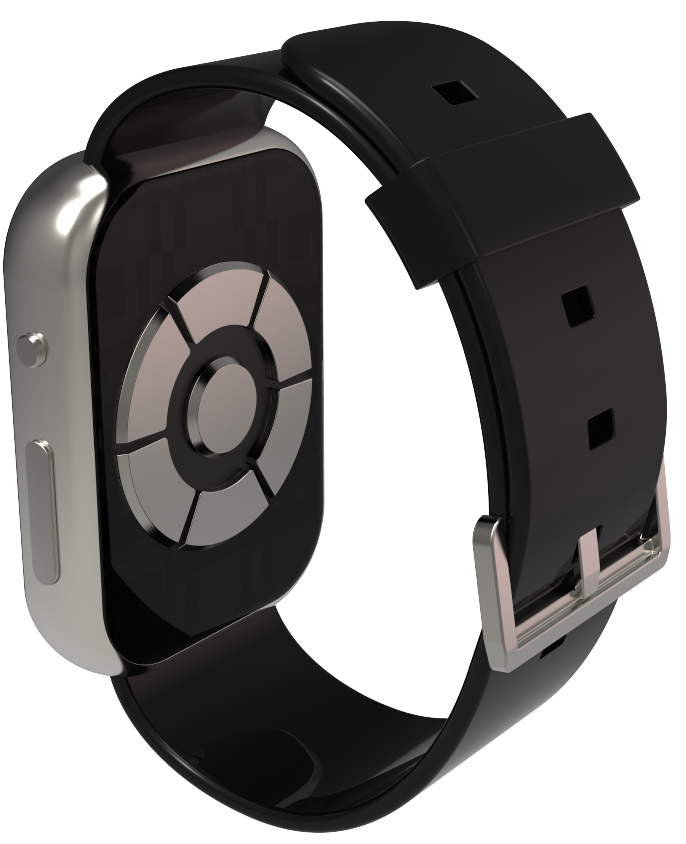

# NoBarriers Technology Co., Ltd.

NoBarriers Technology Co., Ltd. is a high-tech enterprise focused on the field of neuroelectric signal human-computer interaction. The company is dedicated to applying the combination of bioelectric signal and artificial intelligence algorithms to the field of human-computer interaction. With independently developed neuroelectric signal acquisition modules, bioelectric signal acquisition chips, and signal processing algorithms, the company has constructed a leading comprehensive bioelectric signal acquisition and recognition system in China.

## Core Competitive Technologies

The company possesses significant core competitive strengths in the field of neuroelectric interaction technology, including:

- **Self-developed Neuroelectric Signal Acquisition Modules**: Developed neuroelectric signal acquisition equipment with a sampling rate ranging from 200-2000Hz, capable of collecting high-precision electromyography (EMG) signals. The number of acquisition channels can be adjusted to suit various application scenarios.
- **Data Processing and Deep Learning Recognition Algorithms**: The algorithms can quickly filter out data that meets the requirements, remove abnormal information, and retain as much effective neuroelectric data as possible. Based on the accumulated large-scale EMG data, a myoelectric action recognition paradigm has been completed, which can accurately recognize EMG signals of various scenes, actions, and intensities.
- **Neuroelectric Decomposition Algorithm**: The proprietary algorithm can decompose EMG into multiple-channel Motor Unit (MU) information, improving the performance by 15% over traditional blind source separation algorithms.
- **Extendable Acquisition Structure Design**: Advanced extendable conductive materials are used to solve the elasticity issues of electrodes and transmission leads.

## Products and Services

NoBarriers Technology's product line covers a full range of solutions from hardware devices to software algorithms, including but not limited to:

- **Comprehensive Bioelectric Signal Acquisition System**: The SHOWING system, including both software and hardware solutions, has completed the acquisition of over 10 million neuroelectric data entries, building a large-scale unified scheme EMG dataset.
- **Virtual Hand**: Calculates 21 degrees of freedom of hand key points through sensor data to synchronize the hand state into the virtual world.
- **Input Method**: An input method based on myoelectric and neuroelectric signals, providing an efficient interaction method not limited by external scenarios.
- **Micro-movement Interaction**: Controls the visual interface through small hand movements, providing core interaction technology for wearable mobile scenarios.
- **Electromyography Action Recognition System**: Utilizes deep learning algorithms to complete electromyography action recognition and improve recognition accuracy.

## Product Gallery

#### Band V2.1

#### Band V3.0

#### HCI

### Product Showcase

## Cooperation and Achievements

NoBarriers Technology has established cooperative relationships with many well-known institutions and enterprises, including Beihang University, Zhejiang University, the Central Military Commission, Xiao Tian Cai, ByteDance, and Xiaomi, and has undertaken pre-research projects from the Central Military Commission, being the only private enterprise approved. The company has more than 10 patents that have been granted and are under review, with more than 10 patents pending. In 2021, it was rated as a national high-tech enterprise.